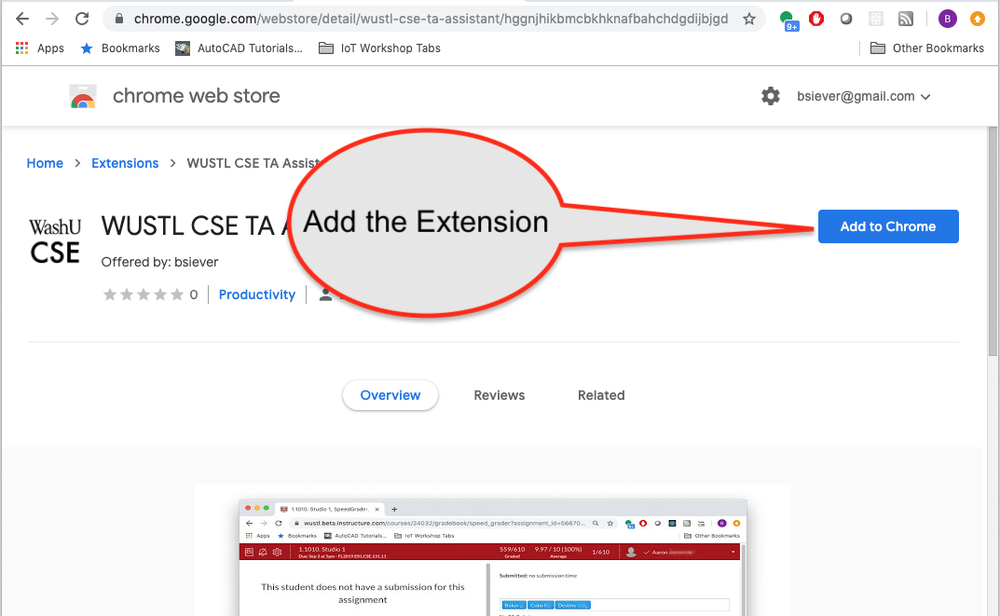

# 1. Quick Intro

<iframe src="https://wustl.app.box.com/embed/s/pzankd0xyhgxb0dve27o3m0cnd5c02r2?sortColumn=date&view=list" width="500" height="400" frameborder="0" allowfullscreen webkitallowfullscreen msallowfullscreen></iframe>

# 2. Chrome 

**Be sure to bring Laptops (with [Chrome](https://www.google.com/chrome/) installed) to all sessions where you may be doing demos!**

# 3. Extension Installation

Click here: [https://chrome.google.com/webstore/detail/wustl-cse-ta-assistant/hggnjhikbmcbkhknafbahchdgdijbjgd](https://chrome.google.com/webstore/detail/wustl-cse-ta-assistant/hggnjhikbmcbkhknafbahchdgdijbjgd)

# 4. Getting to SpeedGrader for Assignment

<iframe src="https://wustl.app.box.com/embed/s/jvyvecg8zo4aq8w3gtumng8cudm06qiy?sortColumn=date&view=list" width="500" height="400" frameborder="0" allowfullscreen webkitallowfullscreen msallowfullscreen></iframe>

# 5. Lab Grading

<iframe src="https://wustl.app.box.com/embed/s/89okdji4n8uja4zlfxpmp0keg0bcpq7m?sortColumn=date&view=list" width="500" height="400" frameborder="0" allowfullscreen webkitallowfullscreen msallowfullscreen></iframe>

# 6. Extension Grading

<iframe src="https://wustl.app.box.com/embed/s/xeiei1yfpn5293lspz0bbrq7mcoq5kjj?sortColumn=date&view=list" width="500" height="400" frameborder="0" allowfullscreen webkitallowfullscreen msallowfullscreen></iframe>

# 7. Studio Grading

<iframe src="https://wustl.app.box.com/embed/s/emdqagc3p0wclf54gy8av1aivki19ca2?sortColumn=date&view=list" width="500" height="400" frameborder="0" allowfullscreen webkitallowfullscreen msallowfullscreen></iframe>

# 8. Updating Extensions when updated

<iframe src="https://wustl.app.box.com/embed/s/0zb4v4d2kr3vqd4lfup6jw4onja3sokj?sortColumn=date&view=list" width="500" height="400" frameborder="0" allowfullscreen webkitallowfullscreen msallowfullscreen></iframe>

# 9. Questions about Use

## Q. What if I enter the wrong grade? 

A. You can select the student(s) again, return to the rubric, and update the grade.

## Q. The when I return to a student the rubric doesn't show comments I left and/or the rubric doesn't include items I selected.  Why not?

A. Try reloading the page.  (Sometimes data is posted correctly, but the returned results aren't used to update the local data store.  This is an area of future work)

## Q. What if I enter a grade for the wrong student?

A. You can go back to the "wrong student" again and update the grade to be a 0. This will update the lab score, but *not* coupons. Please contact a Head TA or instructor if coupons were used.  (There shouldn't be any problems with either Extensions or Studios)

## Q. What if I see error messages?

A. Contact instructors/TAs with details about the issue. In particular: 1) students involved, 2) What grade should have been recorded, and 3) When you were entering data!

